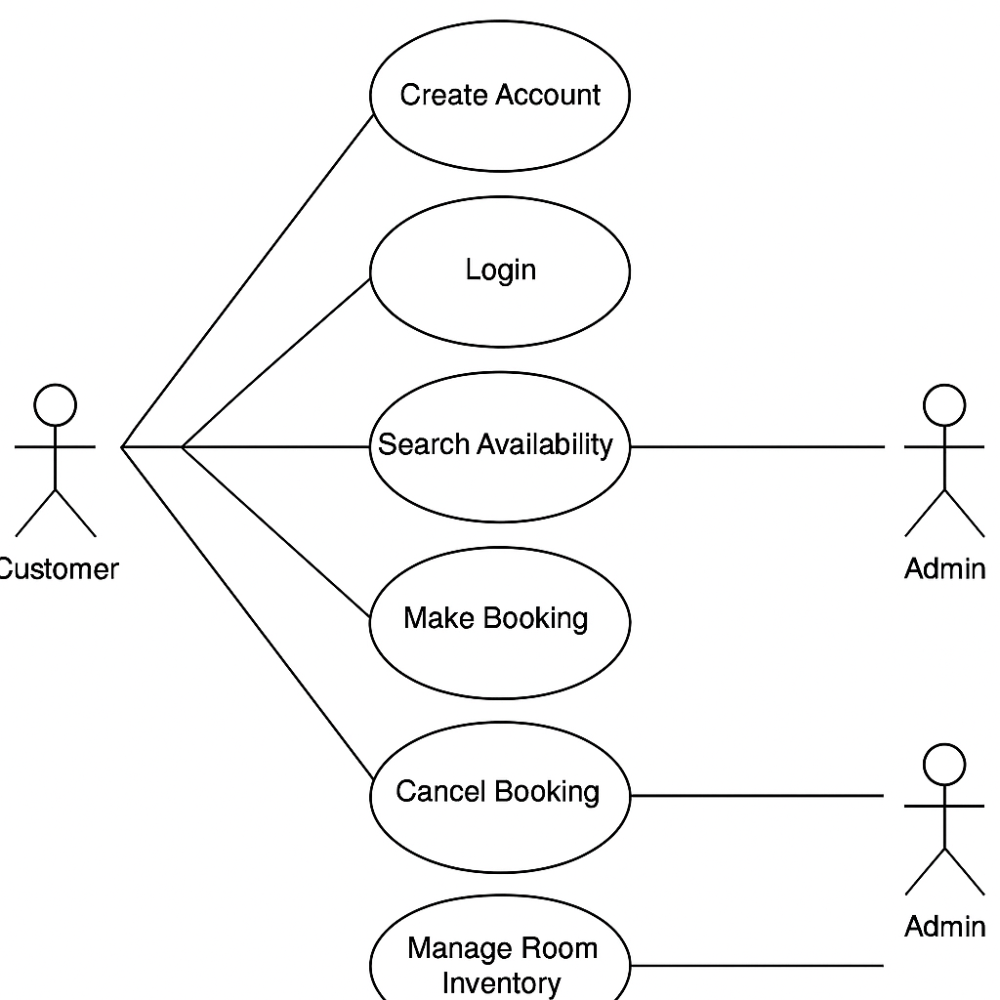

# Requirement Analysis in Software Development

Welcome to the **Requirement Analysis** repository.

This repository is dedicated to exploring the foundational phase of the software development life cycle — **Requirement Analysis**. It outlines the process of gathering, analyzing, and documenting stakeholder needs and system expectations before design and implementation begin.

The goal of this project is to understand how accurate and thorough requirement analysis leads to successful software solutions by aligning technical development with real-world needs.

## What is Requirement Analysis?

**Requirement Analysis** is the process of identifying, documenting, and managing the needs and expectations of stakeholders for a software system. It is one of the most critical stages in the Software Development Life Cycle (SDLC) because it lays the foundation for what the system must achieve.

During this phase, software engineers, business analysts, and stakeholders collaborate to gather both **functional** and **non-functional** requirements. These can include user needs, system behaviors, performance expectations, constraints, and compliance requirements.

### Importance in the Software Development Lifecycle (SDLC)

1. **Clarifies Project Scope**  
   Clearly defines what the system should do and what it should not do, helping to prevent scope creep and misunderstandings.

2. **Aligns Stakeholder Expectations**  
   Ensures that all stakeholders—including clients, developers, and users—are on the same page regarding deliverables and priorities.

3. **Reduces Risk of Failure**  
   Proper requirement analysis minimizes costly redesigns, delays, and the risk of building software that doesn't meet user needs.

4. **Supports Planning and Estimation**  
   Well-defined requirements allow for accurate time, cost, and resource estimation, leading to better project planning.

5. **Improves Design and Development Quality**  
   A clear understanding of requirements results in better architecture, cleaner code, and more maintainable systems.

### Outcome

The output of requirement analysis is typically a set of structured documents such as:
- **Software Requirement Specification (SRS)**
- **User Stories or Use Cases**
- **Process Flows and Diagrams**

These artifacts guide the entire development lifecycle and ensure the final product aligns with business goals and user needs.

## Why is Requirement Analysis Important?

Requirement Analysis is a foundational phase of the Software Development Life Cycle (SDLC) because it ensures that the software being built addresses the actual needs of users and stakeholders. Here are three key reasons why this phase is critical:

1. **Prevents Miscommunication and Scope Creep**  
   Clearly defined requirements reduce misunderstandings between developers, clients, and users. They set a shared vision and avoid scope creep by establishing boundaries early in the project.

2. **Improves Planning and Estimation**  
   Detailed and accurate requirements help project managers estimate timelines, allocate resources, and set realistic budgets. This improves the overall predictability of the project.

3. **Ensures Higher-Quality Deliverables**  
   When developers understand what the system is supposed to do, they can design cleaner architecture and write better code. This reduces bugs, rework, and improves user satisfaction.

By investing time in requirement analysis, teams reduce risks and set themselves up for delivering software that is both functional and user-centric.

## Key Activities in Requirement Analysis

The process of Requirement Analysis involves a series of structured activities that ensure stakeholders’ needs are properly captured, understood, and documented. Below are the five key activities:

- **Requirement Gathering**  
  Collecting information from stakeholders, users, and domain experts to understand what the system should do. This may involve interviews, questionnaires, and existing system reviews.

- **Requirement Elicitation**  
  Actively engaging with stakeholders to draw out hidden, implicit, or conflicting requirements. Techniques include workshops, brainstorming sessions, and use case analysis.

- **Requirement Documentation**  
  Translating gathered and elicited requirements into structured formats such as Software Requirements Specifications (SRS), user stories, or use case diagrams for clarity and communication.

- **Requirement Analysis and Modeling**  
  Examining the documented requirements to ensure they are complete, consistent, and feasible. This step may involve creating models like data flow diagrams, UML diagrams, or wireframes to visualize the system.

- **Requirement Validation**  
  Verifying that the documented requirements accurately reflect the needs of the stakeholders. This often includes reviews, walkthroughs, and prototyping to confirm understanding before development begins.

## Types of Requirements

In software development, requirements are generally categorized into two main types: **Functional** and **Non-functional**. Understanding both is essential for designing a well-rounded and user-centered system.

### Functional Requirements

Functional requirements describe **what the system should do**. They define the core functions, business logic, and behavior of the application.

**Examples for a Booking Management System:**
- Users can create an account and log in.
- Customers can search for available rooms based on location and date.
- The system allows users to book, cancel, or reschedule a reservation.
- Admins can manage room availability and pricing.
- Confirmation emails are sent automatically after a successful booking.

### Non-functional Requirements

Non-functional requirements specify **how the system performs** under certain conditions. These often relate to usability, performance, reliability, and security.

**Examples for a Booking Management System:**
- The system should load search results within 2 seconds.
- The application must support up to 10,000 concurrent users.
- User data must be encrypted both in transit and at rest.
- The system should maintain 99.9% uptime availability.
- The user interface must be responsive and accessible on mobile devices.
## Use Case Diagrams

**Use Case Diagrams** are visual representations of the interactions between users (actors) and a system. They help in understanding what the system should do and how different users interact with it.

### Benefits of Use Case Diagrams:
- Provide a high-level overview of the system’s functionality.
- Help identify different user roles and their goals.
- Support requirement validation by visualizing user interactions.
- Serve as a communication tool between stakeholders and developers.

### Use Case Diagram for Booking Management System

The following diagram illustrates the primary actors and use cases in a simple booking system:

## Acceptance Criteria

### Importance of Acceptance Criteria in Requirement Analysis

Acceptance Criteria (AC) are essential for defining the conditions that a software product or feature must satisfy in order to be considered complete and functioning as intended. They help in:

1. **Clarifying Requirements**: AC ensure that all stakeholders, including developers, product owners, and testers, have a clear and shared understanding of the feature's functionality and expected behavior.
2. **Guiding Development**: They provide the development team with specific guidelines, reducing ambiguity and ensuring that the feature meets user needs and expectations.
3. **Facilitating Testing**: AC serve as the foundation for writing test cases, making it easier to validate whether the feature works as expected before release.
4. **Providing Traceability**: AC help trace the requirements to the delivered functionality, ensuring that the project stays aligned with business goals and user requirements.
5. **Ensuring Consistency**: They contribute to consistency in feature development, especially when multiple teams or developers are working on the same project.

### Example of Acceptance Criteria for Checkout Feature

Below is an example of how Acceptance Criteria for a checkout feature in a booking management system could be defined:

---

#### **Acceptance Criteria for Checkout Feature**

1. **AC1**: The user must be able to add a booking to their cart before proceeding to checkout.
   - **Given** a user has selected a booking, 
   - **When** they click on the "Add to Cart" button, 
   - **Then** the booking should appear in the cart.

2. **AC2**: The user must see a summary of their booking details in the cart.
   - **Given** a user is on the cart page, 
   - **When** they review their cart, 
   - **Then** the system should display the booking details (e.g., date, time, location, price).

3. **AC3**: The user must be able to enter payment information on the checkout page.
   - **Given** a user is ready to checkout, 
   - **When** they proceed to the checkout page, 
   - **Then** the page should prompt them to enter payment details (e.g., credit card, PayPal).

4. **AC4**: The system must validate the payment information.
   - **Given** a user has entered their payment details, 
   - **When** they submit the payment information, 
   - **Then** the system should validate the payment details and show an error message if the payment fails.

5. **AC5**: The user must receive a confirmation of the booking once the payment is successful.
   - **Given** the user has successfully paid for their booking, 
   - **When** the payment is confirmed, 
   - **Then** the system should display a confirmation message with booking details and send a confirmation email.

6. **AC6**: The system must allow users to cancel their booking within 24 hours of booking.
   - **Given** the user is on the booking details page, 
   - **When** they choose to cancel the booking within 24 hours, 
   - **Then** the system should cancel the booking and provide a cancellation confirmation.

